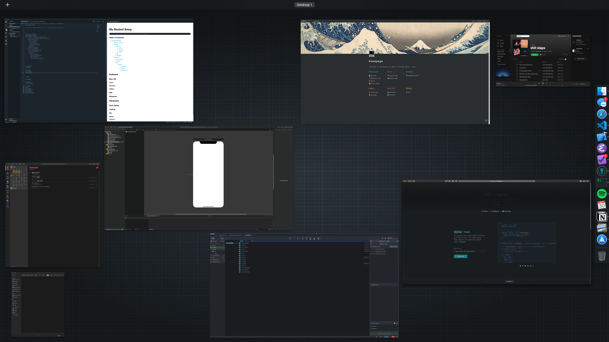

# My Student Setup

> My personal device and desk setup as a full-time student and developer.

### Table of Contents
- [My Student Setup](#my-student-setup)
    - [Table of Contents](#table-of-contents)
  - [Software](#software)
    - [Mac OS](#mac-os)
      - [Editors](#editors)
      - [Browser](#browser)
      - [Utilities](#utilities)
    - [IOS](#ios)
    - [Windows](#windows)
  - [Hardware](#hardware)
    - [Desk Setup](#desk-setup)
    - [Laptop](#laptop)
    - [PC](#pc)
      - [Inputs](#inputs)
        - [Keyboard](#keyboard)
        - [Mouse](#mouse)
        - [Microphone](#microphone)

## Software
### Mac OS

#### Editors
  ##### [VSCode](https://code.visualstudio.com)
  - VSCode is hands down one of my favorite editors for writing almost anything!
  

  - It has a dead simple, and beautiful UI which makes it easy to add and customize to your heart's content.  
  - I'm currently using [this](http://citylights.xyz) theme.

  ##### [Eclipse](https://www.eclipse.org)
  - Unfortunately, as a University Student, I'm required to use Eclipse as my java editor (If you know how to make it look less ugly please let me know im trying my best here).

  

  - If you're being forced to use this atrocity as well, here's a few tips to help ease the pain.
    1. Go into the settings and change the color immediately! The dark mode isn't good but its worlds better than the default!
    2. For those of you that know emacs keys this editor will slowly kill you unless you go into Preferences>General>keys and switch the scheme from Default to Emacs. 
    3. Command + shift + L opens keybindings which you can customize to your heart's content which I would highly recommend! (Ctrl + space will give you auto complete BTW)
  ##### [Xcode](https://developer.apple.com/xcode/)
#### Browser
  ##### Safari
#### Utilities

### IOS

### Windows

## Hardware 
### Desk Setup

### Laptop
### PC
#### Inputs
##### Keyboard
##### Mouse
##### Microphone