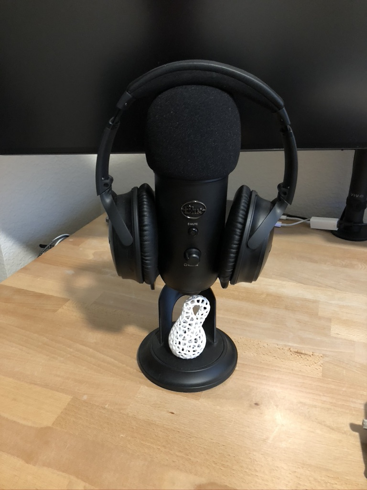

# My Student Setup

> My personal device and desk setup as a full-time student and developer. Inspired by https://github.com/nikitavoloboev

### Table of Contents

- [My Student Setup](#my-student-setup)
    - [Table of Contents](#table-of-contents)
  - [Software](#software)
    - [Mac OS](#mac-os)
      - [Editors](#editors)
        - [VSCode](#vscode)
        - [Eclipse](#eclipse)
        - [Xcode](#xcode)
      - [Browsers](#browsers)
        - [Safari](#safari)
        - [Chrome](#chrome)
        - [Firefox](#firefox)
      - [Utilities](#utilities)
        - [Notion](#notion)
        - [Alfred](#alfred)
    - [IOS](#ios)
    - [Windows 10](#windows-10)
  - [Hardware](#hardware)
    - [Desk Setup](#desk-setup)
    - [Laptop](#laptop)
    - [PC](#pc)
      - [Inputs](#inputs)
        - [Keyboard](#keyboard)
        - [Mouse](#mouse)
        - [Microphone](#microphone)
        - [Headphones](#headphones)

## Software

---

### Mac OS

#### Editors

##### [VSCode](https://code.visualstudio.com)

- VSCode is hands down one of my favorite editors for writing almost anything!
  

- It has a dead simple, and beautiful UI which makes it easy to add and customize to your heart's content.
- I'm currently using [this](http://citylights.xyz) theme.

##### [Eclipse](https://www.eclipse.org)

- Unfortunately, as a University Student, I'm required to use Eclipse as my java editor (If you know how to make it look less ugly please let me know im trying my best here).

- If you're being forced to use this atrocity as well, here's a few tips to help ease the pain.
  1. Go into the settings and change the color immediately! The dark mode isn't good but its worlds better than the default!
  2. For those of you that know emacs keys this editor will slowly kill you unless you go into Preferences>General>keys and switch the scheme from Default to Emacs.
  3. Command + shift + L opens keybindings which you can customize to your heart's content which I would highly recommend! (Ctrl + space will give you auto complete BTW)

##### [Xcode](https://developer.apple.com/xcode/)

#### Browsers

- Im constantly switching between these three browsers for different reasons but mostly settle on safari for macos for its speed and light resource usage as well as the reading list which I use often.
- Extentions

  - [LastPass](https://www.lastpass.com/solutions/business-password-manager)
  - [Dark Reader](https://darkreader.org/)
  - [Grammarly](https://app.grammarly.com/)
  - [Vimari](https://github.com/televator-apps/vimari) (Safari)/ [Vim Vixen](https://addons.mozilla.org/en-US/firefox/addon/vim-vixen/) (Firefox)

  ##### Safari

    

  ##### Chrome

    

  ##### Firefox

    

#### Utilities

##### Notion
  

##### Alfred
- Alfred is an incredible replacement for macos spotlight and I use it hundreds of times a day to launch applications and run many of the powerful [Workflows](https://github.com/learn-anything/alfred-workflows#readme) you can find.

- Workflows

  - [Spotify Workflow](https://github.com/vdesabou/alfred-spotify-mini-player)

     

    - One of my alltime favorite Workflows!
    - Lets you use Alfred to fully controll Spotify, I rarely ever have to open the actual app anymore.

* [Battery Workflow](https://github.com/BenziAhamed/alfred-battery)

  

  - Workflow which gives you some basic information about the health of your laptop, its battery and the serial number of your device.

* [AWS Workflow](https://github.com/rkoval/alfred-aws-console-services-workflow)

    
      

    * Allows for quick and easy search through AWS services.

    

    * An absolute necessity if you use AWS for work or school.

- [Fakeum](https://github.com/deanishe/alfred-fakeum)

     

  - Allows user to create fake data which is super useful in dumb online forms asking for all of your personal info.

- [GitHub](https://github.com/gharlan/alfred-github-workflow)

     

  - Helps give me quick access to my gitHub repos.
  - Also theres a look at some of my private repos, you're welcome!

* [Bluetooth](https://github.com/tilmanginzel/alfred-bluetooth-workflow)

   

  - Bluetooth in my experience is a perpetual nightmare but this workflow makes it a whole lot better.
  - Reconnects, pairs and sometimes shows the battery level of your bluetooth devices.

- [Network Info](https://github.com/jeppestaerk/alfred-show-network-info)

  

  - Sometimes you just need to know what your network info is. This workflow can help you out.

### IOS

### Windows 10
- Currently Im only using windows 10 for gaming on my PC.
- [My specs](https://www.notion.so/Devices-7f411619d1a04e75b1880ee87e9fdf0f#c5f8f08d18594b4dbb5f18088f084aeb)

## Hardware

---

### Desk Setup

- Sitting

  

- Standing

  

  - I recently bought the sit stand base for this desk on amazon and after a brief construction it has been Extremely Comfortable.
  - I highly recommend one of these for ergonomics and mode switching, I'm usually standing when working and sitting when I do everything else to help my brain switch into and out of work mode.

### Laptop

- My current Laptop is the 15" MacBook Pro 
- I love this computer my only regret is not getting enough storage I got the 250 GB version, at the time it seemed like plenty and I wanted to save some money but after constantly having a maxed out drive I really wish I had just spent the extra money at the beginning. 

### PC

#### Inputs

---

##### Keyboard

- Currently im using the [Ergodox EZ](https://ergodox-ez.com) and absolutely loving it.
- After a considerable amount of typing on the [Poker3](https://mechanicalkeyboards.com/shop/index.php?l=product_detail&p=3527) over the summer I developed some significant pain in my forearm, I think this had more to do with my overuse and setup of the keyboard than the keyboard itself though and would still highly reccommend the poker to anyone looking at it!
- As a PSA this keyboard takes a little while to get used to, as it is both split, and Ortholinear (meaning that the keys are straight up and down instead of staggered like a normal keyboard). Though I personally think the combination of the more comfortable hand position and the [programmability](https://github.com/qmk/qmk_firmware/tree/master/keyboards/ergodox_ez) of this keyboard more than makes up for the steep learning curve.
- You can find the setup I made for it [here](https://github.com/EthanHolen/ergodoxLayouts)

##### Mouse

- In the spirit of switching fully to an ergonomic setup I also switched out my previous mouse the [MX Master](https://www.amazon.com/Logitech-Master-Wireless-Mouse-High-precision/dp/B00TZR3WRM) for its more ergonomic brother, the [MX Vertical](https://www.logitech.com/en-us/product/mx-vertical-ergonomic-mouse).
- Ive liked this mouse quite a bit since switching and was surprised to find that there was almost no adjustment period despite its odd shape. The feeling is vaguely that of giving someone a handshake and my hand fell into the position really naturally.

##### Microphone

- The [Blue Yeti](https://www.bluedesigns.com/products/yeti/) has been an awesome (and probably overkill) microphone for me.
- As a nerd I have a few random side projects I work on occasionally and one of them is recording an audio book.
- This mic has been super fun to mess around with and as a bonus works super well as a [headphone](#headphones) stand.
- The little 3D printed [klein bottle](https://www.youtube.com/watch?v=AAsICMPwGPY&t=1s) is a gift from my friend [Jake](https://jake.vossen.dev) and its awesome!

##### Headphones
